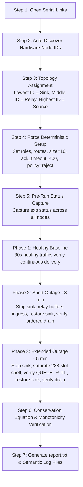

# Testbed Logging & Automation Tools (`tools/logger`)

This directory contains host-side Python utilities for capturing serial UART telemetry, interacting with node shells, and conducting automated multi-node benchmarks on the Conexio Stratus Pro DECT NR+ testbed.

---

## 1. Tool Overview

| Utility | Description | Primary Use Case |
|:---|:---|:---|
| **[`sf_auto_test.py`](sf_auto_test.py)** | Fully automated 3-node store-and-forward outage benchmark orchestrator | `experiments/06_store` outage resilience, custody verification, and backlog drain testing |
| **[`serial_logger.py`](serial_logger.py)** | Interactive/passive single-board serial capture tool with host timestamps | Live manual debugging, shell interaction, and baseline single-node logging |

---

## 2. Setup & Virtual Environment

The scripts require Python 3.10+ and `pyserial`. On Windows systems without global PySerial, use the dedicated virtual environment located in this directory:

```powershell
# Navigate to the logger directory
cd tools\logger

# Activate or install dependencies into the local venv
.\.venv\Scripts\python.exe -m pip install -r requirements.txt
```

---

## 3. Store-and-Forward Auto Test Runner (`sf_auto_test.py`)

### 3.1 Purpose & Architecture

[`sf_auto_test.py`](sf_auto_test.py) is a standalone, deterministic test orchestrator designed for `experiments/06_store`. It eliminates manual typing over the serial console and executes an end-to-end, multi-phase outage benchmark across a 3-node linear mesh:

```
[ Source ] ----(Hop 1)----> [ Relay ] ----(Hop 2)----> [ Sink / Gateway ]
(Node 56992)               (Node 44720)                (Node 14402)
```

The script manages three concurrent serial connections (direct Windows COM ports or networked RFC2217 sockets), auto-discovers node hardware IDs, enforces deterministic test parameters, simulates network outages by stopping and restoring the sink, and validates hop custody and ordered backlog delivery.

---

### 3.2 Execution Workflow



1. **Node Discovery & Topology Mapping:**  
   Queries `exp status` on all three connected boards. The nodes are automatically sorted by their hardware ID:
   * **Lowest ID** is designated as the **Sink** (`exp role sink`).
   * **Middle ID** is designated as the **Relay** (`exp role relay`).
   * **Highest ID** is designated as the **Source** (`exp role source`).
2. **Deterministic Setup:**  
   Sends `exp stop` and `exp flush`, then configures routes, hello beacons, transmission interval (1000 ms), application payload size (16 bytes), hop ACK timeout (400 ms), and overflow policy (`reject`).
3. **Phase 1: Healthy Baseline (30 seconds):**  
   Verifies that end-to-end transmissions flow continuously over the 2-hop path with no `BAD_FRAME` or premature `QUEUE_FULL` drops.
4. **Phase 2: Short Outage (3 minutes / 180 seconds):**  
   Stops the sink node. The relay holds custody of incoming frames in its RAM store. The sink is restored, and the test runner monitors delivery until the backlog completely drains in ordered FIFO sequence.
5. **Phase 3: Extended Outage (5 minutes / 300 seconds):**  
   Stops the sink long enough for the relay's 288-slot telemetry shelf to fill. Verifies that the relay asserts `QUEUE_FULL` backpressure gracefully without crashing or dropping admitted custody. The sink is restored, and all admitted frames drain in order.
6. **Pass/Fail Evaluation:**  
   Validates that all delivered sequence numbers are strictly contiguous, checks that no unannounced drops occurred, and outputs a final `PASS` or `FAIL` verdict.

---

### 3.3 Command-Line Options

```text
usage: sf_auto_test.py [-h] [--baud BAUD] [--out-dir OUT_DIR]
                       [--healthy-duration HEALTHY_DURATION]
                       [--outage-short OUTAGE_SHORT]
                       [--outage-long OUTAGE_LONG]
                       [--drain-timeout DRAIN_TIMEOUT]
                       [--payload-size PAYLOAD_SIZE] [--interval INTERVAL]
                       [ports ...]
```

| Argument | Type | Default | Description |
|:---|:---|:---|:---|
| `ports` | Positional | `COM7 socket://10.0.0.139:7777 socket://10.0.0.139:7778` | Exactly three serial ports or RFC2217 network URLs |
| `--baud` | Integer | `115200` | Serial baud rate |
| `--out-dir` | Path | `tools/logger/sf_logs/<timestamp>` | Directory where logs and `report.txt` are saved |
| `--healthy-duration` | Integer | `30` | Duration of initial baseline validation (seconds) |
| `--outage-short` | Integer | `180` | Duration of the short outage phase (seconds) |
| `--outage-long` | Integer | `300` | Duration of the extended outage phase (seconds) |
| `--drain-timeout` | Integer | `180` | Maximum time to wait for backlog drain after restoration (seconds) |
| `--payload-size` | Integer | `16` | Application payload size in bytes (*16 required on nRF9151 modem*) |
| `--interval` | Integer | `1000` | Source packet generation interval in milliseconds |

---

### 3.4 Usage Examples

#### Run default bench setup (COM7 + two network serial sockets):
```powershell
.\.venv\Scripts\python.exe sf_auto_test.py
```

#### Specify three local USB COM ports:
```powershell
.\.venv\Scripts\python.exe sf_auto_test.py COM3 COM4 COM5
```

#### Save logs directly to the experiment data directory:
```powershell
.\.venv\Scripts\python.exe sf_auto_test.py --out-dir ..\..\data\06_store\my_new_run
```

#### Quick smoke test (shorter outage windows):
```powershell
.\.venv\Scripts\python.exe sf_auto_test.py --healthy-duration 15 --outage-short 30 --outage-long 60
```

---

### 3.5 Output Artifacts

Each benchmark run produces a dedicated folder containing four timestamped artifacts:

| File | Content |
|:---|:---|
| **`source.txt`** | Full console log from the Source node with host timestamps |
| **`relay.txt`** | Full console log from the Relay node with host timestamps |
| **`sink.txt`** | Full console log from the Sink node with host timestamps |
| **`report.txt`** | Summary report containing parameter checkpoints, backlog drain metrics, and the PASS/FAIL verdict |

---

## 4. Single-Node Serial Logger (`serial_logger.py`)

Capture UART from an individual Stratus Pro board to the terminal **and** a text file simultaneously. By default, you can interact with the Zephyr shell (`exp status`, `exp start`, etc.) directly from the console window.

### 4.1 Quick Start

```powershell
# List available COM ports
python serial_logger.py --list

# Open interactive session on COM9
python serial_logger.py COM9

# Capture to a custom destination file
python serial_logger.py COM9 --out ../../data/03_topology/run_c.txt

# Non-interactive capture (monitoring / logging only)
python serial_logger.py COM9 --no-interact
```

### 4.2 Timestamps

Every logged line is prefixed with the host PC's local wall clock (`HH:MM:SS.mmm` from `datetime.now()`):

| Timestamp | Source | Purpose |
|:---|:---|:---|
| `[15:42:01.123]` prefix | Host PC clock | Aligns asynchronous events across boards logged by the same PC |
| `time=589164` inside line | Board `k_uptime` ms | Internal node clock; useful for local delta measurements |

Commands typed during interactive mode are recorded as `>>> <command>` with the host timestamp.

---

## 5. Best Practices & Troubleshooting

* **Exclusive COM Port Access:** Close the nRF Connect Serial Terminal or any other serial monitor before starting `sf_auto_test.py` or `serial_logger.py`. On Windows, only one process can hold an open handle to a COM port.
* **Payload Sizing:** Keep `--payload-size 16`. Due to modem subslot padding on the nRF9151 physical layer, 48-byte and 64-byte frames result in padded buffers that the current firmware parser flags as invalid frames.
* **Clean Abort:** Press `Ctrl+C` to interrupt `sf_auto_test.py` gracefully. The runner catches `KeyboardInterrupt`, broadcasts `exp stop` to all nodes, closes serial ports, and renames partial logs for post-mortem analysis.
