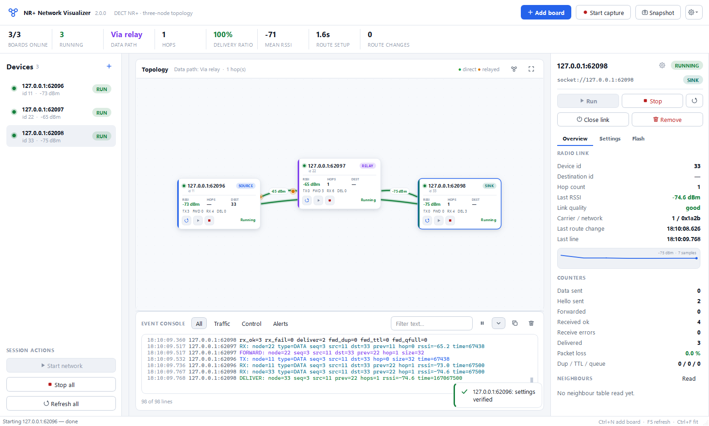

# NR+ Network Visualizer

Operator console for the `03_topology` experiments on Conexio Stratus Pro (nRF9151).
It connects to two or three boards over USB serial or a TCP bridge, shows the live
DECT NR+ topology, and drives every board through verified `exp` shell commands —
the operator never types a shell command by hand.



<sub>More: [dark theme](docs/running_dark.png) · [settings tab](docs/settings_tab.png) ·
[flash tab](docs/flash_tab.png)</sub>

## Install

```text
cd tools/topology_visualizer
uv venv .venv
uv pip install --python .venv/Scripts/python.exe -r requirements.txt
```

On OneDrive, if uv reports hardlink errors: `$env:UV_LINK_MODE="copy"`.

## Run

```text
.\.venv\Scripts\python.exe app.py                                     # pick ports in the connect dialog
.\.venv\Scripts\python.exe app.py --ports COM9 --connect              # skip the dialog
.\.venv\Scripts\python.exe app.py --ports "COM9,socket://10.0.0.139:7777,socket://10.0.0.139:7778"
.\.venv\Scripts\python.exe app.py --demo                              # three simulated boards, no hardware
.\.venv\Scripts\python.exe app.py --theme dark
```

`--demo` starts an in-process simulation of a source / relay / sink network that
speaks the same shell dialect as the firmware. Use it to learn the tool, to
rehearse a procedure, or to check the UI after a change.

## What the window shows

**Header** — session KPIs: boards online, nodes running, data path
(direct / via relay / both), hop count, delivery ratio, mean RSSI, route setup
time and route changes.

**Device rail** — every board with its live state, device id and last RSSI, plus
session actions: *Start network* (starts sink → relay → source in that order),
*Stop all*, *Refresh all*.

**Canvas** — one card per board showing role, device id, RSSI, hop count,
destination and counters, with per-node Refresh / Run / Stop buttons. Links are
drawn between boards that actually hear each other, coloured by signal quality
and labelled with RSSI; packets animate along the path they took (green direct,
amber relayed). Cards can be dragged, renamed (double-click) and are laid out by
role with *Arrange* (Ctrl+Shift+A). Positions and names are remembered per port.

**Inspector** — three tabs for the selected board:

- *Overview*: link telemetry, RSSI trend, counters, packet loss, neighbour table.
- *Settings*: role, destination, intervals, packet count, TX power, MCS, payload,
  max hops. Apply is enabled only when the form differs from the board; the values
  are written with `exp role` / `exp sett` and then read back with `exp status`.
  If the board reports anything different, the change is reported as **not
  verified** and nothing is assumed.
- *Flash*: autostart toggle plus `exp save` / `exp load` / `exp factory`, so a
  board resumes its role after a reset — the basis of the Week 4 healing tests
  (see `docs/03_topology/PERSIST_AUTOSTART.md`).

**Event console** — the raw feed from every board, colour-coded, with
All / Traffic / Control / Alerts filters, text search, pause, follow, copy and clear.

## Safety behaviour

- Every command is queued per board and acknowledged; the UI blocks with a
  cancellable progress card while a verified operation is in flight.
- Stale telemetry disappears: RSSI after 2.5 s, links after 3 s, the path class
  after 4 s, so nothing on screen outlives the radio.
- Runs and destructive actions ask for confirmation and show what will change
  (both prompts can be turned off in the gear menu).
- A dropped link keeps the node on the canvas, marked offline, with its name,
  position and counters intact; you can reopen it or remove it.
- Mouse wheel never edits a parameter field.

## Step-by-Step Operator Guide

### 1. Launch & Connect Boards
1. Connect 2 or 3 Conexio Stratus Pro dev boards via USB-C (or via TCP bridges using `tools/logger/tcp_serial_redirect.py`).
2. Start the application:
   ```text
   .\.venv\Scripts\python.exe app.py
   ```
3. In the **Connect** dialog, check the boxes for your boards' COM ports (e.g. `COM7`, `COM8`, `COM9`) and click **Connect**.
4. The boards will be queried with `exp status` automatically and appear on the canvas.

### 2. Name & Arrange Nodes
- **Rename:** Double-click any node title (or select it and press **F2**) to give it a descriptive label (e.g., `Node A`, `Node B`, `Node C`).
- **Layout:** Press **Ctrl+Shift+A** (or click *Arrange*) to automatically position the nodes by topological role, or drag cards freely across the infinite canvas. Positions are persisted across restarts.

### 3. Configure Roles & Radio Parameters (Inspector → Settings)
1. Select a node on the canvas to open its properties in the right-hand **Inspector**.
2. Switch to the **Settings** tab:
   - **Role:** Choose `source`, `relay`, or `sink`.
   - **Destination ID:** For a `source`, enter the `device_id` of the target `sink`.
   - **TX Power:** Set power level (`1` for attenuated multi-hop tests, up to `7`).
   - **Interval / Count:** Set transmission period in ms (e.g., `500` or `1500`) and packet limit (`0` for continuous).
3. The **Apply** button illuminates amber when edits differ from the board. Click **Apply**:
   - The UI displays a progress card while commands (`exp role`, `exp sett`) are sent, acknowledged, and read back via `exp status`.
   - The form returns to clean state only after full hardware verification.

### 4. Persist Configuration to Flash (Inspector → Flash)
For fault-tolerance and self-healing tests (Week 4), nodes must resume their roles immediately after power loss:
1. In the Inspector, open the **Flash** tab.
2. Toggle **Auto-start on boot** ON.
3. Click **Save Profile & Auto-start to Flash**:
   - This issues `exp autostart 1` followed by `exp save`.
   - The node is now configured to cold-boot into its role in $\sim 595\text{ ms}$ without human intervention.

### 5. Record Capture Data
1. Click **Start capture** on the toolbar (or press **Ctrl+L**).
2. Enter a session name (e.g., `Restart_A`, `Remove_B`, `Move_B`).
3. The visualizer begins streaming timestamped lines to `tools/topology_visualizer/data/<name>/`.

### 6. Start the Network Run
- Click **Start network** in the device rail (or top toolbar):
  - The visualizer automatically starts nodes in the correct dependency order: **Sink $\to$ Relay $\to$ Source**.
- **Observe Live Visuals:**
  - **Links:** Directed colored lines appear between nodes that overhear each other, labeled with live RSSI badges (green $\ge -50$, lime $\ge -65$, amber $\ge -80$, red $<-80\text{ dBm}$).
  - **Flying Packets:** Circles travel along the active air path (**green** for direct $A \to C$, **amber** for relayed $A \to B \to C$).
  - **Console:** The bottom pane displays live color-coded events filtered by *All*, *Traffic*, *Control*, or *Alerts*.

### 7. Stop Capture & Export Data
1. Click **Stop capture** (or **Ctrl+L**).
2. The session files are finalized in `tools/topology_visualizer/data/<name>/`:
   - Raw logs: `<node_name>_log.txt`
   - Manifest: `session.json`
   - Summary: `final_snapshot.json` (also exportable on-demand via **Ctrl+E**).
3. Click the gear menu $\to$ **Open Data Folder** to view outputs in Windows Explorer.

## Capture Files & Structure

*Start capture* asks for a session name and writes to
`tools/topology_visualizer/data/<name>/` (see [data/README.md](data/README.md)):

- `<node_name>_log.txt` — one log per board, prepended with host wall-clock `[HH:MM:SS.mmm]` timestamps, stripped of ANSI escapes, in the same format as `tools/logger/serial_logger.py`.
- `session.json` — machine-readable capture manifest with participating nodes, device IDs, roles, and port bindings.
- `final_snapshot.json` — full network state at capture stop (counters, delivery ratio, link RSSI, and topology graph).

*Snapshot* (Ctrl+E) exports the current topology as JSON at any time.

## Shortcuts

| Action | Key |
| --- | --- |
| Add board | Ctrl+N |
| Refresh selected | F5 |
| Rename selected | F2 |
| Fit / arrange | Ctrl+F / Ctrl+Shift+A |
| Zoom | Ctrl+wheel, Ctrl+`+`, Ctrl+`-`, Ctrl+0 |
| Start / stop capture | Ctrl+L |
| Export snapshot | Ctrl+E |
| Toggle dark theme | Ctrl+D |
| Clear selection | Esc |

## Layout

```text
app.py                  entry point and CLI
core/   transport.py    serial + TCP links, one reader thread per board
        parse_topo.py   firmware line parsers (pure functions)
        router.py       one parsing pipeline feeding UI and command engine
        commands.py     queued, acknowledged exp commands per board
        model.py        live session model, staleness, KPIs, snapshots
        logging_session.py  capture files and manifest
        store.py        preferences, window state, node layout
ui/     theme.py        palette + stylesheet (light and dark)
        icons.py        vector icons painted at runtime
        widgets.py      cards, tiles, badges, spinner, toasts, busy overlay
        canvas.py       topology view: node cards, links, packet animation
        devices.py      device rail
        inspector.py    overview / settings / flash panel
        console.py      filtered event console
        dialogs.py      connect flow, confirmations, prompts
        main_window.py  application shell and orchestration
mock/   board.py        simulated boards for --demo and tests
tests/  test_smoke.py   headless regression run
```

## Tests

```text
.\.venv\Scripts\python.exe tests\test_smoke.py
.\.venv\Scripts\python.exe tests\test_smoke.py --shots artifacts --show
```

The run starts three simulated boards and drives the real UI against them:
parsing, status discovery, verified apply, network start, relayed delivery,
staleness, neighbour read, capture files, snapshot export, both themes, link loss
and layout persistence. `--shots` writes screenshots, `--show` uses a real window
(the offscreen backend has no fonts, so text renders as boxes without it).
